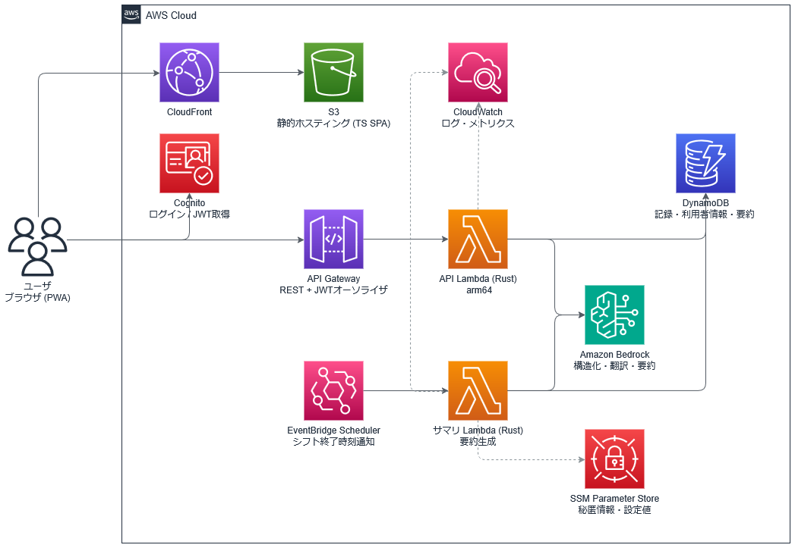

# AIヘルパー　わびすけ

介護現場のシフト交代時の「申し送り」を支援するWebアプリ

## 背景と課題

- 介護現場ではシフト交代時の申し送りが**残業の主要因**となっている．日勤帯は複数職員が利用者を分担してケア・記録するが，夜勤者は1〜2名で全員を引き継ぐため，複数職員の記録を横断して把握する必要があり，口頭申し送りという定時外の拘束が生まれる
- 外国人職員は日本語の会話はできても**記録文書の作成が困難**な可能性がある

## 主な機能

1. **ケアメモの構造化** — 職員が対象の利用者を選んでテキストでケアメモを投稿すると，LLMが介護記録として構造化(カテゴリ: 食事・水分・排泄・バイタル・インシデント・特記，正規化された日本語本文)し，職員が下書きを確認・修正して承認．**「誰の記録か」はLLMに推定させず，職員の選択を唯一の情報源とする**
2. **母語入力対応** — 他言語で入力しても，LLMが翻訳と構造化を同時に行い日本語の記録として保存（原文と言語コードも保存）
3. **横断申し送りサマリ** — シフト終了時刻に，そのフロア・シフト帯の全職員の承認済み記録と各利用者の平常時情報から，次の勤務者向けに「要注意・変化あり・特記なし」の3段階優先度付きサマリを自動生成
4. **介護専門用語辞書の参照** — 介護記録に頻出する略語・現場用語（VS・ADL・PEG，端座位・陰洗・傾眠・トランス等）を静的辞書として同梱し，構造化・要約のプロンプトに注入．RAGのような大規模構成を持たずに，LLMが専門用語を誤読・誤展開するのを防ぐ（辞書に無い語は推測せず原文のまま残し確認を促す）

> **安全性の方針**: LLMには診断・治療・ケア方針の提案をさせず，記録の転記・要約・整形と「確認を促す」表現に限定．全記録は職員の承認を経てのみ確定．専門用語辞書による用語展開も「転記・整形」の範囲に留め，略語から病名・重症度等の記録に無い事実は導かせない

## システムアーキテクチャ



| レイヤ | 構成 |
|---|---|
| フロントエンド | Vite + React + TypeScript SPA / S3 + CloudFront配信 |
| 認証 | Amazon Cognito (JWT) |
| API | API Gateway HTTP API + JWTオーソライザ |
| バックエンド | Rust Lambda ×2 (provided.al2023 / arm64 / lambda_http + axum) |
| LLM | Amazon Bedrock (Claude) — 構造化・翻訳・要約 |
| DB | DynamoDB 単一テーブル　|
| スケジュール | EventBridge Scheduler (サマリ生成) |
| 設定値 | SSM Parameter Store |
| IaC | AWS CDK (TypeScript) + cargo-lambda-cdk |

## アピールポイント — 既存の介護記録サービスと何が違うか

介護記録の**入力・保存・音声/テキスト化**を担うサービスはすでに数多く存在する．本アプリはそれらと同じ土俵で「記録を楽にする」ことを競うのではなく，**記録が溜まった"後"に残る「大量の記録から何を優先して引き継ぐか」と「外国人職員が日本語で記録を残せるか」に取り組む点で差別化を図った．

### ①：AIが申し送りに「優先度」を付ける（＝記録の要約に留まらない）

- **既存サービス**：記録をきれいに残す／時系列やカテゴリで一覧・検索できる．しかし「今どの利用者を最優先で見るべきか」の判断に時間を要する
- **本サービス**：日勤帯に複数職員が別々に残した承認済み記録を，シフト終了時にフロア単位で1つのサマリへ統合し，**「要注意 / 変化あり / 特記なし」の3段階優先度**を自動で付与．引継ぎ者は膨大な記録から，**まず見るべき利用者の把握**ができる
- **安全性との両立**：優先度付けは診断ではなく，記録内容を要約・整理して職員の確認を促すもの．診断・治療・ケア方針の提案はさせず，全記録は職員の承認を経てのみ確定するため，AIに判断はさせない

### ②：母語入力をその場で日本語記録へ翻訳・構造化

- **既存サービス**：入力・表示のUIを多言語化するものはあっても，職員が母語で書いた文章を**日本語の正式な介護記録として保存**するところまでは踏み込めていない．結果，日本語での記録作成が外国人職員の負担として残る可能性がある
- **本サービス**：他言語で入力しても，LLMが**翻訳と構造化を同時に実行**し日本語の記録として保存（原文 `original_text` と言語コード `lang` も必ず保持）．UIの翻訳ではなく，**記録という成果物そのものを言語の壁を越えて生成**する点が新規性．深刻化する介護人材の多国籍化に直接効く

### 技術・設計

- **記録の作成者・承認者を証跡として保持** — 各記録に作成者・承認者を Cognito のユーザーIDで焼き込み，「誰がいつ書き，誰が承認したか」を追跡．承認済み記録は物理削除・上書きを禁止し，訂正は新規記録として追加するため，記録の改ざん耐性と説明責任を担保
- **Rust製Lambdaで低コールドスタート** — バックエンドを Rust（provided.al2023 / arm64）で実装．軽量ネイティブバイナリのためコールドスタートが短い
- **S3 + CloudFront によるエッジ配信** — フロントエンドSPAを S3 に置き CloudFront でキャッシュ配信するため，エッジから高速に初期表示できる．VPC・サーバー常駐なしのフルサーバレス構成で，運用負荷とアイドルコストを最小化
- **DynamoDB単一テーブル設計** — フロア単位のキー設計と時系列ソートキーにより，申し送りに必要な「直近シフト分の記録」を蓄積量に依存しない一定コストのクエリで取得
- **利用者は論理削除し，ケア記録は残す** — 介護記録には法定の保存義務があるため，記録を持つ利用者は物理削除せず「退所」として在籍状態のみを変える．現実に起きるのは「削除」ではなく「退所」であり，記録は残したまま一覧から外すのがドメインの実態に合う．記録が1件も無い利用者のみ物理削除を許可
- **Bedrockに利用者の氏名を送らない** — 構造化プロンプトには原文のみを渡し，利用者名・居室番号を一切含めない．個人情報を外部推論サービスへ送る量を最小化すると同時に，プロンプトからフロア全員分の氏名リストが消えるためトークン消費も削減される
- **個人情報は1箇所に集約** — 氏名は利用者アイテムのみが保持し，ケア記録側へ非正規化コピーしない．保存期間経過後の消去や個人情報保護法の利用停止・消去請求に，全記録の書き換えなしで対応できる．ログにも氏名を出力しない

## 動かし方

**AWS上にデプロイして動作確認する構成**．カスタムドメインは使用せず，デプロイ後に発行される CloudFront のデフォルトドメインでアクセス

### 前提条件

| ツール | バージョン目安 |
|---|---|
| AWSアカウント + AWS CLI v2 | 認証設定済み (`aws sts get-caller-identity` が通ること) |
| Node.js | 20以上 |
| Rust | stable (rustup) |
| cargo-lambda | `pip install cargo-lambda` / `brew install cargo-lambda` / `scoop install cargo-lambda` ([公式手順](https://www.cargo-lambda.info/guide/installation.html)) |
| AWS CDK | `npm install -g aws-cdk` (またはnpx使用) |

**Bedrockモデルアクセスの有効化**: デプロイ先リージョン(既定: `ap-northeast-1`)のBedrockコンソール →「モデルアクセス」で **Anthropic Claude** を有効化

### 1. デプロイ

```bash
git clone <このリポジトリ>
cd aws_contest

# フロントエンドの依存関係をインストール（cdk deploy時のビルドに必要）
cd frontend
npm install
cd ..

# デプロイ
cd infra
npm install
npx cdk bootstrap          # 対象アカウント/リージョンで初回のみ
npx cdk deploy
```

`cdk deploy` の中で Rust Lambda のクロスコンパイル(cargo-lambda-cdk)とフロントエンドのビルド・S3アップロードまで実行．完了時に以下が出力:

- `CloudFrontUrl` — アプリのURL
- `UserPoolId` / `UserPoolClientId` — Cognito情報
- `ApiEndpoint` — API Gateway URL

### 2. デモユーザーの作成

```bash
aws cognito-idp admin-create-user \
  --user-pool-id <UserPoolId> \
  --username demo-staff \
  --temporary-password 'TempPass123!' \
  --message-action SUPPRESS

aws cognito-idp admin-set-user-password \
  --user-pool-id <UserPoolId> \
  --username demo-staff \
  --password '<任意のパスワード>' \
  --permanent
```

### 3. 動作確認フロー

1. `CloudFrontUrl` をブラウザで開き，作成したユーザでログイン
2. 利用者マスタ画面で**「デモデータ初期化」**ボタンを押す(架空の利用者・baselineが投入されます)
3. ケアメモを投稿 → LLMが構造化した下書きを確認・修正して承認
4. 言語を多言語に切り替えて母語で投稿 → 日本語記録として構造化されることを確認
5. サマリ画面で手動生成を実行(実運用ではシフト終了時刻に自動生成)
6. 3段階優先度のサマリから根拠記録へドリルダウン
7. サマリ生成後に別の記録を承認 → 「追記」枠に表示されることを確認

### 4. 後片付け

```bash
cd infra
npx cdk destroy
```
